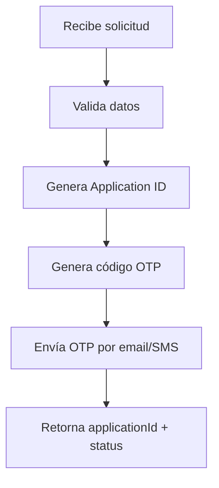

# API Gateway - Documentacion Tecnica

## Tabla de Contenidos

- [Descripción General](#descripción-general)
- [Arquitectura Interna](#arquitectura-interna)
- [Módulos](#módulos)
- [Endpoints API](#endpoints-api)
- [Características Transversales](#características-transversales)
- [Configuración](#configuración)
- [Testing](#testing)
- [Desarrollo](#desarrollo)

---

## Descripción General

El **API Gateway** es el punto de entrada único para todas las peticiones del frontend hacia los microservicios del sistema bancario. Implementado con **NestJS 11**, actúa como proxy inteligente que:

- Enruta peticiones a los microservicios correspondientes
- Implementa autenticación y autorización centralizada
- Aplica rate limiting para protección contra abusos
- Proporciona logging y trazabilidad mediante Correlation IDs
- Expone endpoints de health check y métricas

### Información del Proyecto

| Propiedad | Valor |
|-----------|-------|
| **Nombre** | api-gateway |
| **Puerto** | 5000 |
| **Prefijo** | `/api-gateway/v1` |
| **Framework** | NestJS 11 |
| **Lenguaje** | TypeScript |

---

## Arquitectura Interna

```
api-gateway/
├── src/
│   ├── main.ts                    # Bootstrap de la aplicación
│   ├── app.module.ts              # Módulo raíz
│   ├── common/                    # Funcionalidades transversales
│   │   ├── correlation-id/        # Gestión de Correlation ID
│   │   │   ├── correlation-id.middleware.ts
│   │   │   ├── correlation-id.service.ts
│   │   │   └── correlation-id.module.ts
│   │   └── observability/         # Logging, Health, Tracing
│   │       ├── health/
│   │       ├── logging/
│   │       └── tracing/
│   └── modules/                   # Módulos de negocio
│       ├── applications/          # Solicitudes de productos
│       ├── auth/                  # Autenticación
│       ├── otp/                   # Validación OTP
│       ├── products/              # Proxy a productos
│       └── users/                 # Gestión de usuarios
└── test/
    └── app.e2e-spec.ts
```

### Estructura de Cada Módulo

```
module/
├── core/
│   ├── use-cases/                 # Casos de uso (lógica de negocio)
│   │   └── example.use-case.ts
│   └── index.ts
├── dto/                           # Data Transfer Objects
│   ├── request.dto.ts
│   ├── response.dto.ts
│   └── index.ts
├── repository/                    # Interfaces y adaptadores
│   ├── repository.ts              # Interface
│   ├── repository.http.ts         # Implementación HTTP
│   ├── repository.mock.ts         # Mock para testing
│   └── index.ts
├── services/                      # Controladores HTTP
│   └── controller.ts
├── module.ts                      # Definición del módulo
├── module.spec.ts                 # Tests del módulo
└── index.ts                       # Barrel export
```

---

## Módulos

### 1. Auth Module (Autenticación)

**Responsabilidad:** Gestionar el inicio de sesión de usuarios existentes.

#### Endpoint

```http
POST /api-gateway/v1/auth/login
```

#### Request DTO

```typescript
export class LoginRequestDto {
  @IsString()
  @IsNotEmpty()
  documentNumber: string;    // Número de cédula

  @IsString()
  @IsNotEmpty()
  password: string;          // Contraseña
}
```

#### Response DTO

```typescript
export class LoginResponseDto {
  accessToken: string;       // JWT token
  fullName?: string;         // Nombre del usuario
  userId: string;            // ID del usuario
  isRegistered: boolean;     // Estado de registro
}
```

#### Use Case

```typescript
// LoginUseCase
// Responsabilidades:
// 1. Validar credenciales del usuario
// 2. Generar JWT token
// 3. Retornar información del usuario
```

---

### 2. Users Module (Usuarios)

**Responsabilidad:** Gestionar el registro de nuevos usuarios.

#### Endpoint

```http
POST /api-gateway/v1/users/register
```

#### Request DTO

```typescript
export class RegisterRequestDto {
  @IsString()
  @IsNotEmpty()
  documentNumber: string;    // Número de cédula

  @IsString()
  @IsNotEmpty()
  fullName: string;          // Nombre completo

  @IsString()
  @IsNotEmpty()
  city: string;              // Ciudad de residencia

  @IsNumber()
  @Min(0)
  monthlyIncome: number;     // Ingresos mensuales

  @IsString()
  @MinLength(8)
  password: string;          // Contraseña (mín. 8 caracteres)
}
```

#### Entity

```typescript
export interface UserEntity {
  id: string;
  documentNumber: string;
  fullName: string;
  city: string;
  monthlyIncome: number;
  passwordHash: string;
  createdAt: Date;
}
```

---

### 3. Applications Module (Solicitudes)

**Responsabilidad:** Iniciar el proceso de solicitud de productos bancarios.

#### Endpoint

```http
POST /api-gateway/v1/applications
```

#### Request DTO

```typescript
export class StartApplicationRequestDto {
  @IsString()
  @IsNotEmpty()
  documentNumber: string;       // Número de identificación

  @IsBoolean()
  acceptsDataTreatment: boolean; // Acepta tratamiento de datos
}
```

#### Response DTO

```typescript
export class ApplicationResponseDto {
  applicationId: string;     // UUID de la solicitud
  status: string;            // Estado: 'pending_otp'
  message: string;           // Mensaje informativo
}
```

#### Flujo



---

### 4. OTP Module (Validación)

**Responsabilidad:** Validar y gestionar códigos OTP (One-Time Password).

#### Endpoints

```http
POST /api-gateway/v1/otp/validate
POST /api-gateway/v1/otp/resend
```

#### Request DTO

```typescript
export class ValidateOtpRequestDto {
  @IsString()
  @IsNotEmpty()
  @Length(6, 6)
  otp: string;               // Código de 6 dígitos
}
```

#### Response DTO

```typescript
export class ValidateOtpResponseDto {
  valid: boolean;            // Resultado de validación
  message: string;           // Mensaje descriptivo
  accessToken?: string;      // Token JWT si válido
}
```

---

### 5. Products Module (Productos)

**Responsabilidad:** Actuar como proxy hacia el microservicio de productos.

#### Endpoints

| Método | Endpoint | Descripción |
|--------|----------|-------------|
| GET | `/product/user/:userId` | Listar productos del usuario |
| GET | `/product/:id` | Obtener producto por ID |
| POST | `/product` | Crear nuevo producto |
| PUT | `/product/:id` | Actualizar producto |
| DELETE | `/product/:id` | Eliminar producto |

#### Request DTO (Create)

```typescript
export class CreateProductRequestDto {
  @IsString()
  @IsNotEmpty()
  productId: string;         // ID del tipo de producto

  @IsString()
  @IsNotEmpty()
  documentNumber: string;    // Documento del usuario

  @IsString()
  @IsNotEmpty()
  userId: string;            // ID del usuario
}
```

#### Request DTO (Update)

```typescript
export class UpdateProductRequestDto {
  @IsString()
  @IsOptional()
  name?: string;             // Nombre del producto

  @IsString()
  @IsOptional()
  description?: string;      // Descripción

  @IsIn(['active', 'pending'])
  @IsOptional()
  status?: 'active' | 'pending'; // Estado
}
```

#### Response DTO

```typescript
export type ProductType = 'savings' | 'credit' | 'loan';
export type ProductStatus = 'active' | 'pending' | 'inactive';

export class ProductResponseDto {
  id: string;
  name: string;
  type: ProductType;
  description?: string;
  accountNumber?: string;
  balance: string;
  limit?: string;
  status: ProductStatus;
  rate?: string;
  lastMovement?: string;
}
```

#### Repository Pattern

```typescript
// Interface abstracta
export interface ProductsRepository {
  getProducts(userId: string): Promise<ProductResponseDto[]>;
  getProductById(id: string): Promise<ProductResponseDto>;
  createProduct(dto: CreateProductRequestDto): Promise<ProductResponseDto>;
  updateProduct(id: string, dto: UpdateProductRequestDto): Promise<ProductResponseDto>;
  deleteProduct(id: string): Promise<void>;
}

// Implementación HTTP (llama al microservicio)
@Injectable()
export class ProductsRepositoryHttp implements ProductsRepository {
  private readonly baseUrl = 'http://localhost:4000/products';
  
  constructor(private readonly httpService: HttpService) {}
  
  async getProducts(userId: string): Promise<ProductResponseDto[]> {
    const response = await firstValueFrom(
      this.httpService.get(`${this.baseUrl}/product/user/${userId}`)
    );
    return response.data;
  }
  // ... otros métodos
}
```

---

## Características Transversales

### Correlation ID

El sistema implementa trazabilidad mediante Correlation IDs:

```typescript
// Middleware
@Injectable()
export class CorrelationIdMiddleware implements NestMiddleware {
  use(req: Request, res: Response, next: NextFunction): void {
    const correlationId = req.headers['x-correlation-id'] || uuidv4();
    
    req.headers['x-correlation-id'] = correlationId;
    res.setHeader('x-correlation-id', correlationId);
    
    this.correlationIdService.run(correlationId, () => {
      next();
    });
  }
}

// Servicio (acceso desde cualquier punto)
@Injectable()
export class CorrelationIdService {
  private readonly asyncLocalStorage = new AsyncLocalStorage<string>();
  
  getCorrelationId(): string | undefined {
    return this.asyncLocalStorage.getStore();
  }
}
```

### Rate Limiting (Throttler)

Configuración de tres niveles de protección:

```typescript
ThrottlerModule.forRoot([
  {
    name: 'short',
    ttl: 1000,      // 1 segundo
    limit: 3,       // 3 requests
  },
  {
    name: 'medium',
    ttl: 10000,     // 10 segundos
    limit: 20,      // 20 requests
  },
  {
    name: 'long',
    ttl: 60000,     // 60 segundos
    limit: 100,     // 100 requests
  },
])
```

### Security Headers (Helmet)

```typescript
app.use(
  helmet({
    contentSecurityPolicy: process.env.NODE_ENV === 'production',
  })
);
```

### CORS Configuration

```typescript
app.enableCors({
  origin: process.env.CORS_ORIGINS?.split(',') || ['http://localhost:3000'],
  methods: ['GET', 'POST', 'PUT', 'PATCH', 'DELETE', 'OPTIONS'],
  allowedHeaders: [
    'Content-Type',
    'Authorization',
    'X-Correlation-Id',
    'X-Request-Id',
  ],
  credentials: true,
  maxAge: 86400,
});
```

### Validation Pipe

```typescript
app.useGlobalPipes(
  new ValidationPipe({
    whitelist: true,           // Remueve propiedades no decoradas
    forbidNonWhitelisted: true, // Error si hay propiedades extras
    transform: true,            // Transforma tipos automáticamente
  })
);
```

### Health Checks

| Endpoint | Descripción |
|----------|-------------|
| `/health` | Estado general |
| `/health/liveness` | Verificación de vida |
| `/health/readiness` | Verificación de preparación |

### Métricas Prometheus

```http
GET /metrics
```

Expone métricas en formato Prometheus para monitoreo.

### Logging (Pino)

El sistema usa `nestjs-pino` para logging estructurado:

```typescript
const app = await NestFactory.create(AppModule, { bufferLogs: true });
app.useLogger(app.get(Logger));
```

### OpenTelemetry Tracing

Inicializado antes del bootstrap de NestJS:

```typescript
// main.ts
import { initTracing } from './common/observability/tracing';
initTracing();

// Luego el resto de la aplicación
import { NestFactory } from '@nestjs/core';
```

---

## Configuración

### Variables de Entorno

```env
# Server Configuration
PORT=5000
NODE_ENV=development

# CORS
CORS_ORIGINS=http://localhost:3000,http://localhost:3001

# JWT Configuration
JWT_SECRET=your-super-secret-key-change-in-production
JWT_EXPIRATION=24h

# Microservices URLs
PRODUCTS_SERVICE_URL=http://localhost:4000

# OpenTelemetry (opcional)
OTEL_EXPORTER_OTLP_ENDPOINT=http://localhost:4318
OTEL_SERVICE_NAME=api-gateway
```

### Archivos de Configuración

| Archivo | Descripción |
|---------|-------------|
| `nest-cli.json` | Configuración del CLI de NestJS |
| `tsconfig.json` | Configuración de TypeScript |
| `tsconfig.build.json` | Configuración para build |
| `eslint.config.mjs` | Reglas de ESLint |

---

## Testing

### Ejecutar Tests

```bash
# Tests unitarios
npm run test

# Tests con watch mode
npm run test:watch

# Tests con coverage
npm run test:cov

# Tests e2e
npm run test:e2e
```

### Estructura de Tests

Cada módulo tiene sus propios tests:

```
module/
├── module.spec.ts              # Tests del módulo
└── services/
    └── controller.spec.ts      # Tests del controlador
```

### Mocks

Los repositorios tienen implementaciones mock para testing:

```typescript
// products.repository.mock.ts
@Injectable()
export class ProductsRepositoryMock implements ProductsRepository {
  private products: ProductResponseDto[] = [/* mock data */];
  
  async getProducts(): Promise<ProductResponseDto[]> {
    return this.products;
  }
  // ...
}
```

---

## Desarrollo

### Scripts Disponibles

```bash
# Desarrollo
npm run start:dev       # Hot reload
npm run start:debug     # Debug mode

# Producción
npm run build           # Compilar
npm run start:prod      # Ejecutar build

# Calidad
npm run lint            # Linting
npm run format          # Prettier
```

### Agregar un Nuevo Módulo

1. **Crear estructura de directorios:**
```bash
mkdir -p src/modules/new-module/{core/use-cases,dto,repository,services}
```

2. **Crear DTOs:**
```typescript
// dto/request.dto.ts
export class NewRequestDto {
  @IsString()
  field: string;
}
```

3. **Crear Use Case:**
```typescript
// core/use-cases/example.use-case.ts
@Injectable()
export class ExampleUseCase {
  execute(dto: NewRequestDto): ResponseDto {
    // Lógica de negocio
  }
}
```

4. **Crear Controller:**
```typescript
// services/controller.ts
@Controller('new-module')
export class NewController {
  constructor(private readonly useCase: ExampleUseCase) {}
  
  @Post()
  handle(@Body() dto: NewRequestDto): ResponseDto {
    return this.useCase.execute(dto);
  }
}
```

5. **Crear Module:**
```typescript
// new-module.module.ts
@Module({
  controllers: [NewController],
  providers: [ExampleUseCase],
})
export class NewModule {}
```

6. **Registrar en AppModule:**
```typescript
@Module({
  imports: [
    // ... otros módulos
    NewModule,
  ],
})
export class AppModule {}
```

---

## Dependencias Principales

| Paquete | Versión | Propósito |
|---------|---------|-----------|
| `@nestjs/common` | ^11.0.1 | Core de NestJS |
| `@nestjs/config` | ^4.0.3 | Gestión de configuración |
| `@nestjs/swagger` | ^11.2.6 | Documentación OpenAPI |
| `@nestjs/throttler` | ^6.5.0 | Rate limiting |
| `@nestjs/axios` | ^4.0.1 | Cliente HTTP |
| `@nestjs/jwt` | ^11.0.2 | JWT tokens |
| `@nestjs/passport` | ^11.0.5 | Autenticación |
| `helmet` | ^8.1.0 | Security headers |
| `nestjs-pino` | ^4.5.0 | Logging |
| `class-validator` | ^0.14.3 | Validación de DTOs |
| `uuid` | ^13.0.0 | Generación de UUIDs |

---

*Documentación actualizada: 18 de febrero de 2026*
