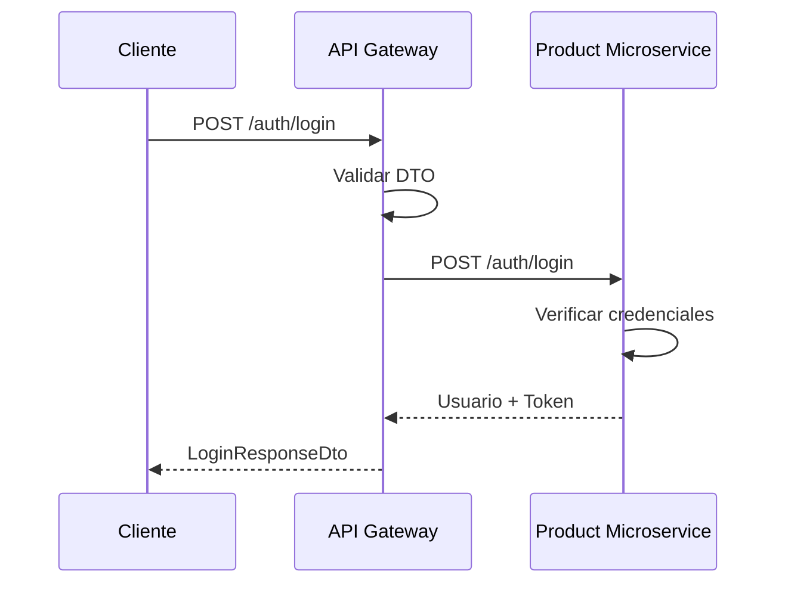

# HU-AG-001: Login de usuarios

## Descripcion

**Como** usuario registrado  
**Quiero** autenticarme en el sistema mediante mi cedula y contrasena  
**Para** acceder a mis productos bancarios

## Criterios de Aceptacion

| # | Criterio | Validacion |
|---|----------|------------|
| 1 | El endpoint recibe `documentNumber` y `password` | POST `/api-gateway/v1/auth/login` |
| 2 | Valida que los campos no esten vacios | Retorna 400 si faltan datos |
| 3 | Verifica credenciales contra el microservicio de productos | Proxy HTTP |
| 4 | Retorna JWT token si las credenciales son validas | `accessToken` en respuesta |
| 5 | Incluye datos del usuario en la respuesta | `fullName`, `userId`, `isRegistered` |

## Datos Tecnicos

**Endpoint:** `POST /api-gateway/v1/auth/login`

**Request:**
```json
{
  "documentNumber": "string",
  "password": "string"
}
```

**Response:**
```json
{
  "accessToken": "string",
  "fullName": "string",
  "userId": "string",
  "isRegistered": true
}
```

## Diagrama de Secuencia



## Archivos Relacionados

- `src/modules/auth/services/auth.controller.ts`
- `src/modules/auth/dto/login-request.dto.ts`
- `src/modules/auth/dto/login-response.dto.ts`
- `src/modules/auth/core/use-cases/login.use-case.ts`
