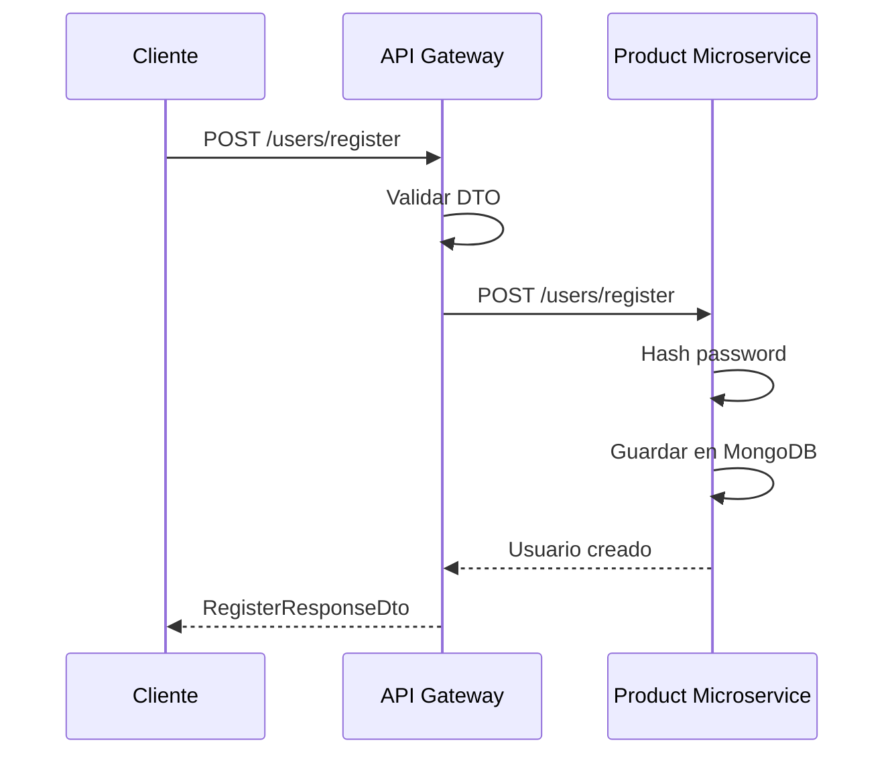

# HU-AG-002: Registro de usuarios

## Descripcion

**Como** usuario nuevo  
**Quiero** registrarme en el sistema bancario  
**Para** poder solicitar productos financieros

## Criterios de Aceptacion

| # | Criterio | Validacion |
|---|----------|------------|
| 1 | El endpoint recibe datos personales del usuario | POST `/api-gateway/v1/users/register` |
| 2 | Valida que la contrasena tenga minimo 8 caracteres | Validacion con class-validator |
| 3 | Valida que el ingreso mensual sea mayor o igual a 0 | `@Min(0)` decorator |
| 4 | Delega la persistencia al microservicio de productos | Proxy HTTP |
| 5 | Retorna el ID del usuario creado | `userId` en respuesta |

## Datos Tecnicos

**Endpoint:** `POST /api-gateway/v1/users/register`

**Request:**
```json
{
  "documentNumber": "string",
  "fullName": "string",
  "city": "string",
  "monthlyIncome": 0,
  "password": "string"
}
```

**Response:**
```json
{
  "userId": "string",
  "message": "string"
}
```

## Diagrama de Secuencia



## Archivos Relacionados

- `src/modules/users/services/users.controller.ts`
- `src/modules/users/dto/register-request.dto.ts`
- `src/modules/users/repository/users.repository.http.ts`
