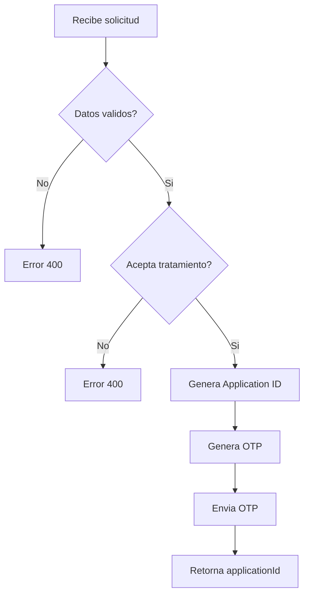

# HU-AG-003: Inicio de solicitud de producto

## Descripcion

**Como** usuario  
**Quiero** iniciar una solicitud de producto bancario  
**Para** recibir un codigo OTP y continuar con el proceso

## Criterios de Aceptacion

| # | Criterio | Validacion |
|---|----------|------------|
| 1 | El endpoint recibe numero de documento y aceptacion de datos | POST `/api-gateway/v1/applications` |
| 2 | Valida que el usuario acepte el tratamiento de datos | Campo `acceptsDataTreatment: true` |
| 3 | Genera un ID unico para la solicitud | UUID v4 |
| 4 | Dispara la generacion de codigo OTP | Estado `pending_otp` |
| 5 | Retorna el ID de la solicitud | `applicationId` en respuesta |

## Datos Tecnicos

**Endpoint:** `POST /api-gateway/v1/applications`

**Request:**
```json
{
  "documentNumber": "string",
  "acceptsDataTreatment": true
}
```

**Response:**
```json
{
  "applicationId": "string",
  "status": "pending_otp",
  "message": "string"
}
```

## Diagrama de Flujo



## Archivos Relacionados

- `src/modules/applications/services/applications.controller.ts`
- `src/modules/applications/dto/start-application-request.dto.ts`
- `src/modules/applications/dto/application-response.dto.ts`
