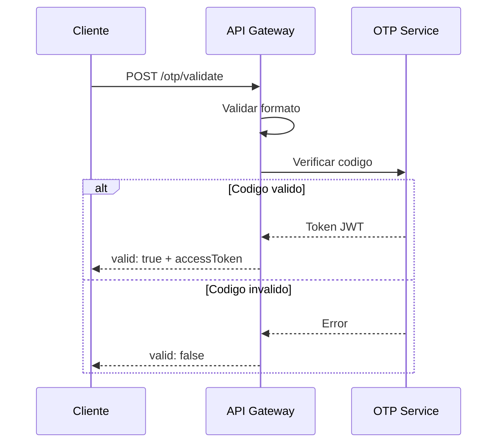

# HU-AG-004: Validacion OTP

## Descripcion

**Como** usuario  
**Quiero** validar el codigo OTP recibido  
**Para** continuar con mi solicitud de producto

## Criterios de Aceptacion

| # | Criterio | Validacion |
|---|----------|------------|
| 1 | El endpoint recibe un codigo de 6 digitos | POST `/api-gateway/v1/otp/validate` |
| 2 | Valida que el codigo tenga exactamente 6 caracteres | `@Length(6, 6)` decorator |
| 3 | Permite reenviar el codigo OTP | POST `/api-gateway/v1/otp/resend` |
| 4 | Retorna token JWT si el codigo es valido | `accessToken` opcional |
| 5 | Indica si la validacion fue exitosa | Campo `valid: boolean` |

## Datos Tecnicos

**Endpoint Validar:** `POST /api-gateway/v1/otp/validate`

**Request:**
```json
{
  "otp": "123456"
}
```

**Response:**
```json
{
  "valid": true,
  "message": "string",
  "accessToken": "string"
}
```

**Endpoint Reenviar:** `POST /api-gateway/v1/otp/resend`

## Diagrama de Secuencia



## Archivos Relacionados

- `src/modules/otp/services/otp.controller.ts`
- `src/modules/otp/dto/validate-otp-request.dto.ts`
- `src/modules/otp/dto/validate-otp-response.dto.ts`
