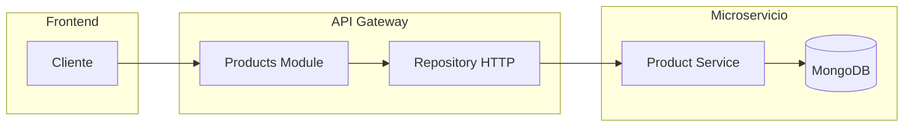

# HU-AG-005: Proxy de productos

## Descripcion

**Como** API Gateway  
**Quiero** exponer endpoints de productos  
**Para** que el frontend acceda al microservicio de productos de forma centralizada

## Criterios de Aceptacion

| # | Criterio | Validacion |
|---|----------|------------|
| 1 | Expone endpoint para listar productos por usuario | GET `/product/user/:userId` |
| 2 | Expone endpoint para obtener producto por ID | GET `/product/:id` |
| 3 | Expone endpoint para crear productos | POST `/product` |
| 4 | Expone endpoint para actualizar productos | PUT `/product/:id` |
| 5 | Expone endpoint para eliminar productos | DELETE `/product/:id` |

## Datos Tecnicos

### Endpoints

| Metodo | Ruta | Descripcion |
|--------|------|-------------|
| GET | `/product/user/:userId` | Listar productos del usuario |
| GET | `/product/:id` | Obtener producto por ID |
| POST | `/product` | Crear producto |
| PUT | `/product/:id` | Actualizar producto |
| DELETE | `/product/:id` | Eliminar producto |

### Request Crear

```json
{
  "productId": "string",
  "documentNumber": "string",
  "userId": "string"
}
```

### Response Producto

```json
{
  "id": "string",
  "name": "string",
  "type": "savings | credit | loan",
  "accountNumber": "string",
  "balance": "string",
  "status": "active | pending | inactive"
}
```

## Diagrama de Flujo



## Archivos Relacionados

- `src/modules/products/services/products.controller.ts`
- `src/modules/products/repository/products.repository.ts`
- `src/modules/products/repository/products.repository.http.ts`
